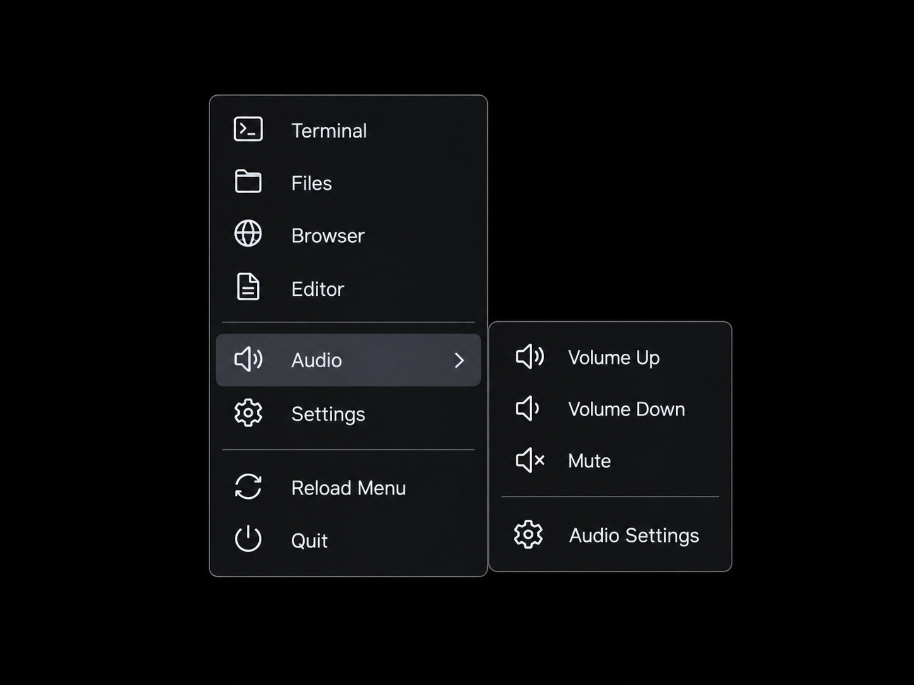

# mHyprMenu

A small native Wayland cascading context menu for Hyprland.



## Design

- Rust only application code
- wlr-layer-shell through smithay-client-toolkit
- wl_shm software rendering
- cosmic-text for UTF-8 text
- no GTK, Qt, Rofi, Wofi, Xlib, XCB or XWayland dependency
- hover opens the second-level menu
- clicking outside closes the menu
- `Up` / `Down` cycle the current menu level
- `Right` enters a submenu and selects its first item
- `Left` returns to the parent menu
- `Enter` activates the selected item
- `Esc` closes the visible menu
- optional persistent daemon keeps Wayland/font state warm for fast popup

The menu gets its initial cursor position from Hyprland's native Unix-socket IPC and then follows Wayland pointer events; it does not use X11 pointer APIs.

## Build

```bash
cargo build --release
```

## Daemon mode

Start once with the Hyprland session:

```bash
mhyprmenu --daemon
```

Then every normal invocation is only a small Unix-socket request:

```bash
mhyprmenu
```

The daemon keeps the Wayland connection, font system and render caches initialized. The actual Layer Shell surface exists only while a menu is visible, so the daemon does not capture pointer input while idle.

Other daemon commands:

```bash
mhyprmenu --reload
mhyprmenu --quit
```

The socket is:

```text
$XDG_RUNTIME_DIR/mhyprmenu.sock
```

If no daemon is running, a normal `mhyprmenu` invocation falls back to one-shot mode.

For dynamic callers such as mHyprBar's tray DBusMenu bridge, force an isolated one-shot instance:

```bash
MHYPRMENU_CONFIG_DIR=/run/user/1000/example-menu mhyprmenu --oneshot
```

`MHYPRMENU_CONFIG_DIR` points directly at a directory containing `config.toml` and
`style.toml`. Forced one-shot mode does not forward the request to a running daemon, so temporary
menus can use their own generated item list without replacing the daemon's normal configuration.

## Config and style

Both files are required at runtime:

```text
~/.config/mhyprmenu/config.toml
~/.config/mhyprmenu/style.toml
```

Install the project examples:

```bash
mkdir -p ~/.config/mhyprmenu
cp config.example.toml ~/.config/mhyprmenu/config.toml
cp style.example.toml ~/.config/mhyprmenu/style.toml
```

`config.toml` contains menu items, commands and submenu structure. `style.toml`
contains layout dimensions, font selection, colors, borders, separators and the
submenu indicator. There are no built-in runtime menu/style defaults; missing
or invalid files are reported as errors.

After editing either file, reload the daemon:

```bash
mhyprmenu --reload
```

## Hyprland

Start the daemon during the Hyprland session, then bind Super + right mouse button to:

```text
mhyprmenu
```

Use Super + RMB rather than bare RMB so application context menus keep working.

## Waybar

A Waybar custom module can execute `mhyprmenu` from its click action.

## License

mHyprMenu is licensed under the [MIT License](LICENSE).
